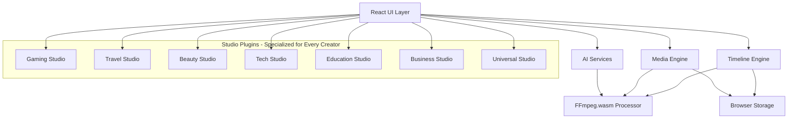

# Design Document: ALLURA Video Editor

## Overview

ALLURA is a browser-based video editing platform built with React 19, TypeScript, and Next.js that leverages WebAssembly (FFmpeg.wasm) for client-side video processing. The platform is designed for all content creators—from gamers and travelers to educators and business professionals—making professional video editing accessible to everyone. The architecture prioritizes performance, privacy, and extensibility through a plugin-based studio system that adapts to different content types. The platform uses OpenAI Whisper for subtitle generation and custom AI models for intelligent highlight detection across various content genres.

### Key Design Principles

1. **Client-Side Processing**: All video processing occurs in the browser using FFmpeg.wasm to ensure user privacy and reduce server costs
2. **Progressive Enhancement**: Core editing features work without AI, with AI features enhancing the experience
3. **Universal Platform with Specialized Studios**: Extensible system supporting specialized editing modes (Gaming, Travel, Beauty, Tech, Education, Business, Universal) while maintaining a consistent core experience
4. **Performance First**: Proxy video generation, Web Workers, and WebGPU acceleration for smooth editing
5. **Platform Agnostic Export**: Social media optimization presets for all major platforms
6. **Accessibility for All**: Professional tools made simple for creators of all skill levels and content types

## Architecture

### High-Level Architecture



### Component Architecture

The system is organized into the following major components:

1. **UI Layer**: React components for timeline, media library, preview, and controls
2. **Timeline Engine**: Manages clip arrangement, playback, and editing operations
3. **Media Engine**: Handles video upload, storage, and proxy generation
4. **FFmpeg Processor**: WebAssembly-based video processing engine
5. **AI Services**: Highlight detection and subtitle generation
6. **Studio Plugin System**: Extensible architecture for specialized editing modes
7. **Export Engine**: Renders final videos with specified settings
8. **Storage Manager**: Handles project persistence and media caching

### Technology Stack

- **Frontend**: React 19, TypeScript, Next.js 14
- **Video Processing**: FFmpeg.wasm (WebAssembly)
- **AI/ML**: OpenAI Whisper API, Custom highlight detection models
- **Styling**: Tailwind CSS
- **State Management**: Zustand for global state
- **Storage**: IndexedDB for media and projects, LocalStorage for preferences
- **Performance**: Web Workers, WebGPU (when available)

## Components and Interfaces

### 1. Media Engine

**Responsibilities:**
- Video file upload and validation
- Media library management
- Proxy video generation for timeline scrubbing
- Thumbnail generation
- Media metadata extraction

**Interface:**

```typescript
interface MediaEngine {
  // Upload and import
  uploadVideo(file: File): Promise<MediaItem>;
  uploadMultipleVideos(files: File[]): Promise<MediaItem[]>;
  
  // Media library
  getMediaLibrary(): MediaItem[];
  getMediaItem(id: string): MediaItem | null;
  deleteMediaItem(id: string): Promise<void>;
  
  // Proxy generation
  generateProxy(mediaId: string, resolution: ProxyResolution): Promise<string>;
  
  // Metadata
  extractMetadata(file: File): Promise<VideoMetadata>;
}

interface MediaItem {
  id: string;
  filename: string;
  format: VideoFormat;
  duration: number;
  resolution: Resolution;
  fileSize: number;
  thumbnailUrl: string;
  proxyUrl?: string;
  uploadedAt: Date;
  metadata: VideoMetadata;
}

interface VideoMetadata {
  codec: string;
  bitrate: number;
  frameRate: number;
  audioCodec: string;
  audioChannels: number;
  hasAudio: boolean;
}

type VideoFormat = 'mp4' | 'mov' | 'avi' | 'webm' | 'mkv';
type ProxyResolution = '360p' | '480p' | '720p';
type Resolution = { width: number; height: number };
```

### 2. Timeline Engine

**Responsibilities:**
- Clip arrangement and manipulation
- Playback control and synchronization
- Track management (video and audio)
- Undo/redo history
- Timeline state persistence

**Interface:**

```typescript
interface TimelineEngine {
  // Clip operations
  addClip(mediaId: string, trackId: string, position: number): Clip;
  moveClip(clipId: string, position: number): void;
  splitClip(clipId: string, position: number): [Clip, Clip];
  trimClip(clipId: string, start: number, end: number): void;
  deleteClip(clipId: string): void;
  
  // Track operations
  addTrack(type: TrackType): Track;
  deleteTrack(trackId: string): void;
  muteTrack(trackId: string, muted: boolean): void;
  
  // Playback
  play(): void;
  pause(): void;
  seek(position: number): void;
  getPlayheadPosition(): number;
  
  // State
  getTimelineState(): TimelineState;
  setTimelineState(state: TimelineState): void;
  
  // History
  undo(): void;
  redo(): void;
  canUndo(): boolean;
  canRedo(): boolean;
}

interface Clip {
  id: string;
  mediaId: string;
  trackId: string;
  position: number;
  duration: number;
  trimStart: number;
  trimEnd: number;
  effects: Effect[];
  transitions: Transition[];
  volume: number;
}

interface Track {
  id: string;
  type: TrackType;
  clips: Clip[];
  muted: boolean;
  locked: boolean;
}

type TrackType = 'video' | 'audio' | 'subtitle';

interface TimelineState {
  tracks: Track[];
  duration: number;
  playheadPosition: number;
  aspectRatio: AspectRatio;
}

type AspectRatio = '16:9' | '9:16' | '1:1' | '4:5' | '4:3';
```

### 3. FFmpeg Processor

**Responsibilities:**
- Initialize FFmpeg.wasm in browser
- Execute video processing operations
- Format conversion and transcoding
- Audio extraction and manipulation
- Progress reporting

**Interface:**

```typescript
interface FFmpegProcessor {
  // Initialization
  initialize(): Promise<void>;
  isReady(): boolean;
  
  // Video operations
  convertFormat(input: Uint8Array, outputFormat: VideoFormat): Promise<Uint8Array>;
  changeResolution(input: Uint8Array, resolution: Resolution): Promise<Uint8Array>;
  extractAudio(input: Uint8Array): Promise<Uint8Array>;
  
  // Clip operations
  trimVideo(input: Uint8Array, start: number, end: number): Promise<Uint8Array>;
  concatenateVideos(inputs: Uint8Array[]): Promise<Uint8Array>;
  
  // Effects
  applyEffect(input: Uint8Array, effect: Effect): Promise<Uint8Array>;
  applyTransition(clip1: Uint8Array, clip2: Uint8Array, transition: Transition): Promise<Uint8Array>;
  
  // Export
  renderTimeline(timeline: TimelineState, settings: ExportSettings): Promise<Uint8Array>;
  
  // Progress
  onProgress(callback: (progress: number) => void): void;
}

interface ExportSettings {
  format: VideoFormat;
  resolution: Resolution;
  bitrate: number;
  frameRate: number;
  audioCodec: string;
  videoCodec: string;
  burnSubtitles: boolean;
}
```

### 4. AI Services

**Responsibilities:**
- Highlight detection using custom models for various content types
- Subtitle generation via OpenAI Whisper
- Viral moment detection across different content genres
- Content-specific event detection (gaming, travel, beauty, tech, education, business)

**Interface:**

```typescript
interface AIServices {
  // Highlight detection
  detectHighlights(mediaId: string, studioType: StudioType): Promise<Highlight[]>;
  
  // Subtitle generation
  generateSubtitles(audioData: Uint8Array, language: string): Promise<Subtitle[]>;
  
  // Gaming-specific
  detectGamingEvents(mediaId: string): Promise<GamingEvent[]>;
}

interface Highlight {
  id: string;
  timestamp: number;
  duration: number;
  confidence: number;
  type: HighlightType;
  description: string;
}

type HighlightType = 
  | 'kill' | 'death' | 'victory' | 'skill' // Gaming
  | 'scenic' | 'action' | 'landmark' // Travel
  | 'tutorial-step' | 'before-after' | 'product-demo' // Beauty
  | 'unboxing' | 'feature-demo' | 'comparison' // Tech
  | 'key-concept' | 'example' | 'summary' // Education
  | 'presentation' | 'data-viz' | 'call-to-action' // Business
  | 'funny' | 'epic' | 'emotional' | 'general'; // Universal

interface Subtitle {
  id: string;
  startTime: number;
  endTime: number;
  text: string;
  confidence: number;
}

interface GamingEvent {
  type: 'kill' | 'death' | 'victory' | 'defeat' | 'achievement';
  timestamp: number;
  confidence: number;
  metadata: Record<string, any>;
}

type StudioType = 'gaming' | 'travel' | 'beauty' | 'tech' | 'education' | 'business' | 'universal';
```

### 5. Studio Plugin System

**Responsibilities:**
- Load and manage studio plugins for all content types
- Provide common API for studio-specific features
- Handle studio switching between different creator modes
- Register studio-specific UI components and AI models for each content genre

**Interface:**

```typescript
interface StudioPluginSystem {
  // Plugin management
  loadStudio(studioType: StudioType): Promise<StudioPlugin>;
  unloadStudio(studioType: StudioType): void;
  getCurrentStudio(): StudioPlugin | null;
  
  // Plugin registration
  registerPlugin(plugin: StudioPlugin): void;
  getAvailableStudios(): StudioType[];
}

interface StudioPlugin {
  type: StudioType;
  name: string;
  version: string;
  
  // Lifecycle
  initialize(context: StudioContext): Promise<void>;
  cleanup(): Promise<void>;
  
  // UI components
  getToolbarComponents(): React.ComponentType[];
  getEffects(): Effect[];
  getTransitions(): Transition[];
  
  // AI models
  getHighlightDetector(): HighlightDetector;
  
  // Export presets
  getExportPresets(): ExportPreset[];
}

interface StudioContext {
  timeline: TimelineEngine;
  media: MediaEngine;
  ffmpeg: FFmpegProcessor;
  ai: AIServices;
}

interface HighlightDetector {
  detect(mediaId: string): Promise<Highlight[]>;
}

interface ExportPreset {
  name: string;
  platform: string;
  settings: ExportSettings;
}
```

### 6. Export Engine

**Responsibilities:**
- Render final video from timeline
- Apply export settings and optimizations
- Handle social media platform presets
- Generate downloadable output

**Interface:**

```typescript
interface ExportEngine {
  // Export operations
  exportVideo(timeline: TimelineState, settings: ExportSettings): Promise<Blob>;
  
  // Platform presets
  getPlatformPresets(): PlatformPreset[];
  applyPlatformPreset(preset: PlatformPreset): ExportSettings;
  
  // Subtitle export
  exportSubtitles(subtitles: Subtitle[], format: SubtitleFormat): Promise<Blob>;
  
  // Progress
  onProgress(callback: (progress: ExportProgress) => void): void;
}

interface PlatformPreset {
  platform: 'youtube' | 'tiktok' | 'instagram' | 'twitter' | 'facebook';
  name: string;
  aspectRatio: AspectRatio;
  maxDuration?: number;
  recommendedResolution: Resolution;
  recommendedBitrate: number;
  recommendedFrameRate: number;
}

interface ExportProgress {
  percentage: number;
  estimatedTimeRemaining: number;
  currentPhase: 'processing' | 'encoding' | 'finalizing';
}

type SubtitleFormat = 'srt' | 'vtt' | 'ass';
```

### 7. Storage Manager

**Responsibilities:**
- Project persistence to IndexedDB
- Media caching and cleanup
- Auto-save functionality
- Import/export project files

**Interface:**

```typescript
interface StorageManager {
  // Project operations
  saveProject(project: Project): Promise<void>;
  loadProject(projectId: string): Promise<Project>;
  deleteProject(projectId: string): Promise<void>;
  listProjects(): Promise<ProjectMetadata[]>;
  
  // Auto-save
  enableAutoSave(interval: number): void;
  disableAutoSave(): void;
  
  // Import/export
  exportProjectFile(projectId: string): Promise<Blob>;
  importProjectFile(file: File): Promise<Project>;
  
  // Media caching
  cacheMedia(mediaId: string, data: Uint8Array): Promise<void>;
  getCachedMedia(mediaId: string): Promise<Uint8Array | null>;
  clearMediaCache(): Promise<void>;
  
  // Storage info
  getStorageUsage(): Promise<StorageInfo>;
}

interface Project {
  id: string;
  name: string;
  timeline: TimelineState;
  mediaLibrary: MediaItem[];
  createdAt: Date;
  updatedAt: Date;
  studioType: StudioType;
}

interface ProjectMetadata {
  id: string;
  name: string;
  createdAt: Date;
  updatedAt: Date;
  thumbnailUrl?: string;
}

interface StorageInfo {
  used: number;
  available: number;
  percentage: number;
}
```

### 8. Effects and Transitions

**Responsibilities:**
- Apply visual effects to clips
- Render transitions between clips
- Manage effect parameters

**Interface:**

```typescript
interface Effect {
  id: string;
  type: EffectType;
  parameters: EffectParameters;
}

type EffectType = 
  | 'brightness'
  | 'contrast'
  | 'saturation'
  | 'blur'
  | 'sharpen'
  | 'vignette'
  | 'chromatic-aberration'
  | 'glitch'
  | 'gaming-overlay';

interface EffectParameters {
  [key: string]: number | string | boolean;
}

interface Transition {
  id: string;
  type: TransitionType;
  duration: number;
  parameters: TransitionParameters;
}

type TransitionType =
  | 'fade'
  | 'dissolve'
  | 'wipe'
  | 'slide'
  | 'zoom'
  | 'gaming-flash'
  | 'gaming-glitch';

interface TransitionParameters {
  [key: string]: number | string | boolean;
}
```

## Data Models

### Project Data Model

```typescript
interface Project {
  id: string;
  name: string;
  timeline: TimelineState;
  mediaLibrary: MediaItem[];
  createdAt: Date;
  updatedAt: Date;
  studioType: StudioType;
  settings: ProjectSettings;
}

interface ProjectSettings {
  defaultAspectRatio: AspectRatio;
  defaultResolution: Resolution;
  autoSaveEnabled: boolean;
  autoSaveInterval: number;
}
```

### Timeline Data Model

```typescript
interface TimelineState {
  tracks: Track[];
  duration: number;
  playheadPosition: number;
  aspectRatio: AspectRatio;
  frameRate: number;
  resolution: Resolution;
}

interface Track {
  id: string;
  type: TrackType;
  clips: Clip[];
  muted: boolean;
  locked: boolean;
  volume: number;
}

interface Clip {
  id: string;
  mediaId: string;
  trackId: string;
  position: number;
  duration: number;
  trimStart: number;
  trimEnd: number;
  effects: Effect[];
  transitions: Transition[];
  volume: number;
  speed: number;
}
```

### Media Data Model

```typescript
interface MediaItem {
  id: string;
  filename: string;
  format: VideoFormat;
  duration: number;
  resolution: Resolution;
  fileSize: number;
  thumbnailUrl: string;
  proxyUrl?: string;
  uploadedAt: Date;
  metadata: VideoMetadata;
  cacheKey: string;
}

interface VideoMetadata {
  codec: string;
  bitrate: number;
  frameRate: number;
  audioCodec: string;
  audioChannels: number;
  audioSampleRate: number;
  hasAudio: boolean;
  hasVideo: boolean;
}
```

### AI Data Models

```typescript
interface Highlight {
  id: string;
  timestamp: number;
  duration: number;
  confidence: number;
  type: HighlightType;
  description: string;
  thumbnailUrl?: string;
  metadata: HighlightMetadata;
}

interface HighlightMetadata {
  audioLevel?: number;
  visualActivity?: number;
  sceneChange?: boolean;
  faceDetection?: boolean;
  textDetection?: string[];
}

interface Subtitle {
  id: string;
  startTime: number;
  endTime: number;
  text: string;
  confidence: number;
  language: string;
  speaker?: string;
}

interface GamingEvent {
  type: 'kill' | 'death' | 'victory' | 'defeat' | 'achievement';
  timestamp: number;
  confidence: number;
  metadata: GamingEventMetadata;
}

interface GamingEventMetadata {
  weapon?: string;
  score?: number;
  streak?: number;
  achievement?: string;
}
```

## Correctness Properties

*A property is a characteristic or behavior that should hold true across all valid executions of a system—essentially, a formal statement about what the system should do. Properties serve as the bridge between human-readable specifications and machine-verifiable correctness guarantees.*

### Property Reflection

After analyzing all acceptance criteria, several properties can be combined or consolidated:

- **Upload and format validation** (1.1, 1.5): Can be combined into a single property about format validation
- **Project save/load** (9.1, 9.2): These form a round-trip property
- **Project export/import** (9.5, 9.6): These form a round-trip property
- **Undo/redo** (15.4, 15.5): These form a round-trip property
- **Timeline clip operations** (2.1, 2.2, 2.4, 2.5, 2.6): Can be tested through timeline state invariants
- **Preview synchronization** (10.1, 10.2, 10.4): Can be combined into a general synchronization property
- **Platform presets** (8.2, 8.3, 8.4): These are specific examples, not separate properties

### Core Properties

**Property 1: Video Format Validation**

*For any* file uploaded to the Video_Editor, if the file format is in the set {MP4, MOV, AVI, WebM, MKV}, then the upload should succeed, and if the format is not in this set, then an error should be returned with a list of supported formats.

**Validates: Requirements 1.1, 1.5**

---

**Property 2: Batch Upload Completeness**

*For any* set of video files uploaded together, all files should be processed and added to the media library, maintaining the count of uploaded files.

**Validates: Requirements 1.6**

---

**Property 3: Timeline Clip Non-Overlap Invariant**

*For any* timeline state, no two clips on the same track should have overlapping time ranges (clip.position to clip.position + clip.duration).

**Validates: Requirements 2.3**

---

**Property 4: Clip Split Preservation**

*For any* clip with duration D split at position P, the resulting two clips should have durations P and (D - P), and the sum of their durations should equal the original duration D.

**Validates: Requirements 2.4**

---

**Property 5: Trim Preserves Original Media**

*For any* clip that is trimmed, the original media item in the media library should remain unchanged (same duration, resolution, and file data).

**Validates: Requirements 2.6**

---

**Property 6: Multi-Track Support**

*For any* timeline, multiple video tracks and multiple audio tracks should be creatable, and clips should be addable to any track independently.

**Validates: Requirements 2.7, 2.8**

---

**Property 7: Playhead-Preview Synchronization**

*For any* playhead position on the timeline, the preview window should display the frame at that exact timestamp within 100 milliseconds.

**Validates: Requirements 2.9, 10.1**

---

**Property 8: Highlight Detection Completeness**

*For any* video analyzed for highlights, the AI_Highlight_Detector should return a list where each highlight has a timestamp, duration, confidence score, and type.

**Validates: Requirements 3.2**

---

**Property 9: Highlight Confidence Classification**

*For any* highlight with confidence score C, if C > 0.8, then the highlight should be marked as high-priority, otherwise it should be marked as normal priority.

**Validates: Requirements 3.7**

---

**Property 10: Studio-Specific Highlight Detection**

*For any* video analyzed in Gaming_Studio mode, the returned highlights should prioritize gaming event types (kill, death, victory, skill) over general highlight types.

**Validates: Requirements 3.6, 6.2**

---

**Property 11: Subtitle Generation Completeness**

*For any* video with audio, when subtitle generation completes, each subtitle entry should have startTime, endTime, text, and confidence fields, and subtitles should be non-overlapping and in chronological order.

**Validates: Requirements 4.3**

---

**Property 12: Subtitle Synchronization**

*For any* subtitle with startTime S and endTime E, during video playback, the subtitle should be visible when playhead position P satisfies S ≤ P < E.

**Validates: Requirements 4.5, 10.4**

---

**Property 13: Subtitle Edit Persistence**

*For any* subtitle that is edited (text or timing), the changes should be immediately reflected in the subtitle data structure and persist across playback.

**Validates: Requirements 4.6, 4.7**

---

**Property 14: FFmpeg Format Conversion**

*For any* video in format F1 where F1 ∈ {MP4, WebM, MOV}, converting to format F2 where F2 ∈ {MP4, WebM, MOV} should produce a valid video in format F2.

**Validates: Requirements 5.6**

---

**Property 15: FFmpeg Resolution Scaling**

*For any* video with resolution R1, scaling to resolution R2 where R2 ∈ {360p, 480p, 720p, 1080p, 4K} should produce a video with resolution R2.

**Validates: Requirements 5.7**

---

**Property 16: Audio Extraction Completeness**

*For any* video with audio, extracting audio should produce audio data with the same duration as the original video.

**Validates: Requirements 4.1, 5.8**

---

**Property 17: Gaming Montage Creation**

*For any* set of highlights H in Gaming_Studio, creating a montage should produce a timeline where clips are arranged in chronological order with transitions between them.

**Validates: Requirements 6.3**

---

**Property 18: Stream Clip Padding**

*For any* highlight at timestamp T with duration D and padding P, the extracted stream clip should start at (T - P) and end at (T + D + P).

**Validates: Requirements 6.6**

---

**Property 19: Export Progress Reporting**

*For any* export operation, progress callbacks should be invoked with monotonically increasing percentage values from 0 to 100.

**Validates: Requirements 7.3**

---

**Property 20: Export Completion**

*For any* successful export operation, the Export_Engine should return a Blob containing valid video data in the specified format.

**Validates: Requirements 7.4**

---

**Property 21: Subtitle Export Options**

*For any* export with subtitles enabled, if burnSubtitles is true, subtitles should be embedded in the video, otherwise a separate SRT file should be generated.

**Validates: Requirements 7.8**

---

**Property 22: Platform Preset Application**

*For any* social media platform preset selected, the export settings should be updated to match the platform's aspect ratio, resolution, and bitrate requirements.

**Validates: Requirements 8.1**

---

**Property 23: Platform Conflict Detection**

*For any* platform preset that conflicts with current project settings (e.g., duration exceeds platform limit), a warning should be displayed listing the conflicts.

**Validates: Requirements 8.5**

---

**Property 24: Aspect Ratio Adjustment**

*For any* platform preset with aspect ratio A, applying the preset should update the timeline aspect ratio to A.

**Validates: Requirements 8.6**

---

**Property 25: Project Save-Load Round Trip**

*For any* project P, saving then loading should produce a project P' where P'.timeline equals P.timeline and P'.mediaLibrary equals P.mediaLibrary.

**Validates: Requirements 9.1, 9.2**

---

**Property 26: Project Export-Import Round Trip**

*For any* project P, exporting to a file then importing that file should produce a project P' equivalent to P.

**Validates: Requirements 9.5, 9.6**

---

**Property 27: Unsaved Changes Detection**

*For any* project with unsaved changes (timeline modified since last save), creating a new project should trigger a save prompt.

**Validates: Requirements 9.3**

---

**Property 28: Auto-Save Interval**

*For any* project with auto-save enabled at interval I, saves should occur at time intervals of I ± 10% (allowing for timing variance).

**Validates: Requirements 9.8**

---

**Property 29: Audio-Video Synchronization**

*For any* timeline with both video and audio tracks, during playback, the audio timestamp should match the video timestamp within 50 milliseconds.

**Validates: Requirements 10.2**

---

**Property 30: Effect Rendering in Preview**

*For any* clip with effects applied, the preview should display the clip with all effects rendered in the order they were added.

**Validates: Requirements 10.3, 14.4**

---

**Property 31: Preview Quality Scaling**

*For any* preview quality setting Q, if Q is "low", preview should render at ≤50% of original resolution, if Q is "high", preview should render at 100% of original resolution.

**Validates: Requirements 10.5, 10.6**

---

**Property 32: Multi-Track Compositing**

*For any* timeline with multiple video tracks, the preview should composite tracks in order (track 0 at bottom, higher track numbers on top).

**Validates: Requirements 10.7**

---

**Property 33: Proxy Generation for Scrubbing**

*For any* video loaded into the media library, a proxy file at reduced resolution should be generated and used for timeline scrubbing.

**Validates: Requirements 11.1**

---

**Property 34: Export Uses Original Files**

*For any* export operation, the rendered video should use original high-resolution media files, not proxy files.

**Validates: Requirements 11.3**

---

**Property 35: Web Worker Non-Blocking**

*For any* video processing operation, the UI should remain responsive (able to handle user input within 100ms) during processing.

**Validates: Requirements 11.5**

---

**Property 36: WebGPU Acceleration**

*For any* browser environment, if WebGPU is available, AI processing should use WebGPU, otherwise it should fall back to CPU processing.

**Validates: Requirements 11.7, 11.8**

---

**Property 37: Studio Plugin Registration**

*For any* studio plugin loaded, the plugin's UI components and AI models should be registered and accessible through the Video_Editor API.

**Validates: Requirements 12.2, 12.3**

---

**Property 38: Studio Switching**

*For any* studio switch from S1 to S2, the current studio S1 should be unloaded (cleanup called) and S2 should be loaded (initialize called).

**Validates: Requirements 12.4**

---

**Property 39: Plugin Load Failure Fallback**

*For any* studio plugin that fails to load, the Video_Editor should display an error and activate Universal Studio as fallback.

**Validates: Requirements 12.6**

---

**Property 40: Audio Track Creation**

*For any* audio file added to the timeline, a new audio track should be created containing a clip referencing that audio file.

**Validates: Requirements 13.1**

---

**Property 41: Audio Clip Splitting**

*For any* audio clip with duration D split at position P, two independent audio clips should be created with durations P and (D - P).

**Validates: Requirements 13.4**

---

**Property 42: Audio Track Muting**

*For any* audio track that is muted, clips on that track should not contribute to the preview audio output or export audio output.

**Validates: Requirements 13.7**

---

**Property 43: Audio Ducking**

*For any* timeline with overlapping audio clips on different tracks, the lower-priority track should have reduced volume during the overlap period.

**Validates: Requirements 13.6**

---

**Property 44: Transition Rendering**

*For any* transition applied between two clips, the preview should display the transition effect during the transition duration.

**Validates: Requirements 14.1**

---

**Property 45: Transition Duration Adjustment**

*For any* transition with duration D, adjusting the duration to D' should update the transition length on the timeline to D'.

**Validates: Requirements 14.3**

---

**Property 46: Effect Stacking Order**

*For any* clip with multiple effects [E1, E2, ..., En], the effects should be applied in order, where the output of Ei is the input to Ei+1.

**Validates: Requirements 14.7**

---

**Property 47: Effect Removal Restoration**

*For any* clip with effects applied, removing all effects should restore the clip to its original appearance (matching the source media).

**Validates: Requirements 14.8**

---

**Property 48: Keyboard Shortcut Playback Toggle**

*For any* playback state S (playing or paused), pressing spacebar should toggle to the opposite state.

**Validates: Requirements 15.1**

---

**Property 49: Undo-Redo Round Trip**

*For any* timeline state T, performing an action to reach state T', then undo to reach T'', then redo should return to state T', where T'' equals T.

**Validates: Requirements 15.4, 15.5**

---

**Property 50: Keyboard Shortcut Customization**

*For any* keyboard shortcut S bound to action A, rebinding S to action B should result in S triggering B instead of A.

**Validates: Requirements 15.7**

## Error Handling

### Error Categories

1. **User Input Errors**: Invalid file formats, unsupported operations, invalid settings
2. **Processing Errors**: FFmpeg failures, memory exhaustion, codec errors
3. **Storage Errors**: Quota exceeded, corrupted data, failed persistence
4. **Network Errors**: API failures (Whisper), timeout errors
5. **Plugin Errors**: Failed plugin load, incompatible plugins, plugin crashes

### Error Handling Strategy

**User Input Errors:**
- Validate all user inputs before processing
- Display clear error messages with actionable guidance
- Provide format lists, valid ranges, and examples
- Never crash or enter invalid state due to user input

**Processing Errors:**
- Wrap all FFmpeg operations in try-catch blocks
- Monitor memory usage and warn before exhaustion
- Provide retry mechanisms for transient failures
- Log detailed error information for debugging
- Display user-friendly error messages

**Storage Errors:**
- Check storage quota before save operations
- Implement graceful degradation (disable auto-save if quota exceeded)
- Provide storage usage information to users
- Attempt recovery for corrupted data
- Offer export options when storage is full

**Network Errors:**
- Implement retry logic with exponential backoff
- Provide offline fallback where possible
- Display clear network error messages
- Allow users to retry failed operations
- Cache results to minimize API calls

**Plugin Errors:**
- Isolate plugin failures to prevent system crashes
- Validate plugin compatibility before loading
- Provide fallback to Universal Studio
- Log plugin errors for debugging
- Display error messages with plugin details

### Error Recovery

**Automatic Recovery:**
- Auto-save recovery on page reload
- Corrupted project recovery attempts
- Automatic fallback to CPU when WebGPU fails
- Automatic fallback to Universal Studio when plugin fails

**User-Initiated Recovery:**
- Manual retry buttons for failed operations
- Project export for backup before risky operations
- Clear cache option for storage issues
- Reset to defaults option for corrupted settings

## Testing Strategy

### Dual Testing Approach

ALLURA requires both unit testing and property-based testing for comprehensive coverage:

**Unit Tests** focus on:
- Specific examples of video processing operations
- Edge cases (empty videos, single-frame videos, very long videos)
- Error conditions (invalid formats, corrupted files, API failures)
- Integration points between components
- UI component rendering and interactions
- Platform-specific preset configurations

**Property-Based Tests** focus on:
- Universal properties that hold for all inputs
- Timeline state invariants
- Round-trip properties (save/load, export/import, undo/redo)
- Format conversion correctness
- Synchronization properties
- Data structure invariants

### Property-Based Testing Configuration

**Framework**: Use `fast-check` for TypeScript/JavaScript property-based testing

**Configuration**:
- Minimum 100 iterations per property test
- Each test tagged with: `Feature: allura-video-editor, Property {N}: {property_text}`
- Custom generators for domain objects (Clip, Track, Timeline, MediaItem)
- Shrinking enabled to find minimal failing examples

**Example Test Structure**:

```typescript
import fc from 'fast-check';

// Feature: allura-video-editor, Property 25: Project Save-Load Round Trip
test('project save-load round trip preserves state', () => {
  fc.assert(
    fc.property(
      projectGenerator(),
      async (project) => {
        const saved = await storageManager.saveProject(project);
        const loaded = await storageManager.loadProject(project.id);
        
        expect(loaded.timeline).toEqual(project.timeline);
        expect(loaded.mediaLibrary).toEqual(project.mediaLibrary);
      }
    ),
    { numRuns: 100 }
  );
});
```

### Test Coverage Goals

- **Unit Test Coverage**: Minimum 80% code coverage
- **Property Test Coverage**: All 50 correctness properties implemented
- **Integration Test Coverage**: All component interfaces tested
- **E2E Test Coverage**: Critical user workflows (upload → edit → export)

### Testing Tools

- **Unit Testing**: Jest, React Testing Library
- **Property Testing**: fast-check
- **E2E Testing**: Playwright
- **Performance Testing**: Lighthouse, Chrome DevTools
- **Accessibility Testing**: axe-core, WAVE

### Continuous Testing

- Run unit tests on every commit
- Run property tests on every pull request
- Run E2E tests nightly
- Run performance tests weekly
- Monitor test execution time and optimize slow tests

### Test Data

- **Video Samples**: Collection of test videos in various formats, resolutions, and durations
- **Audio Samples**: Test audio files with different codecs and sample rates
- **Corrupted Files**: Intentionally corrupted files for error handling tests
- **Large Files**: Files near size limits for performance testing
- **Generated Data**: Property test generators for domain objects

### Mock Services

- **FFmpeg.wasm Mock**: For fast unit tests without actual video processing
- **Whisper API Mock**: For testing subtitle generation without API calls
- **Storage Mock**: In-memory storage for fast test execution
- **WebGPU Mock**: For testing GPU acceleration fallback logic
